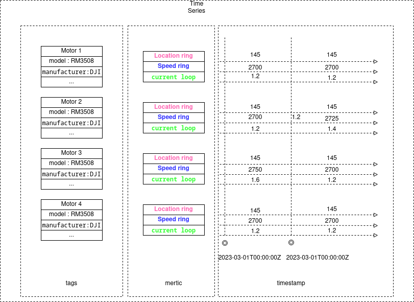
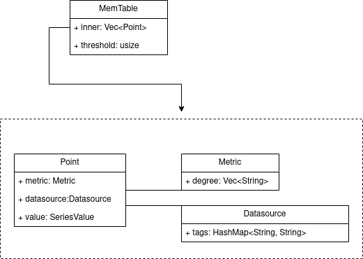

# Macrocosm 时序数据存储引擎设计

## 概述
A very important technical point in the technical system of time series database is the design of time series data model.The following is an example of a time series data scenario of a robot chassis control system:   

## 数据模型
  

## 内存表数据结构
  

## 时序数据存储  
表不是直接使用`create`语句进行创建的，是在数据插入时直接创建的。
