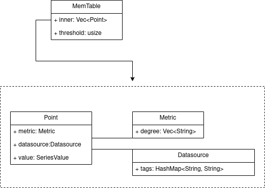

# CosmicDB Time-Series Data Storage Model Design

## Summary
A very important technical point in the technical system of time series database is the design of time series data model.The following is an example of a time series data scenario of a robot chassis control system:   

## Data Model
  

## Memory Table
  